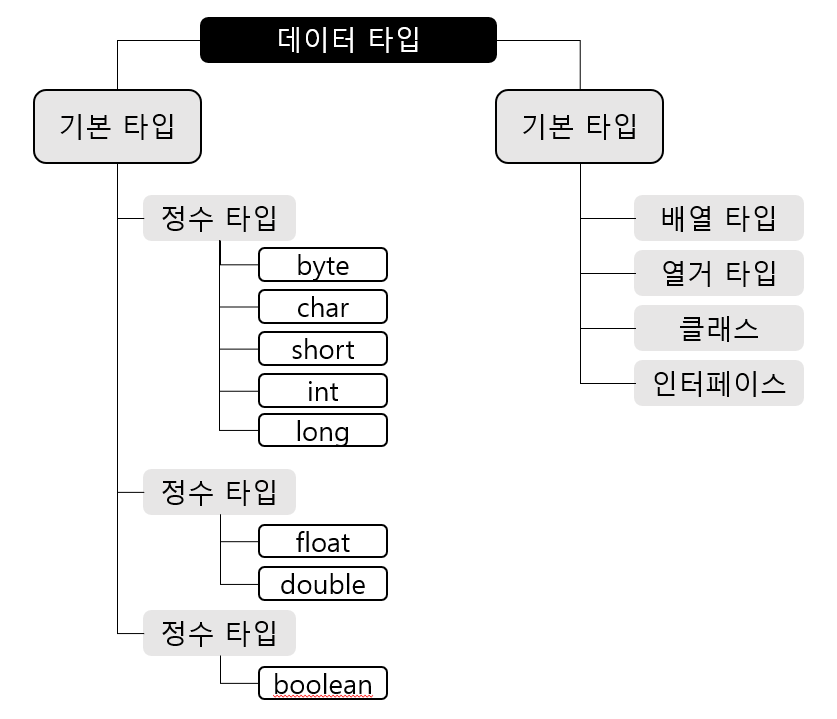

## 참조 타입

#### 데이터 타입 분류

자바의 데이터 타입은 크게 기본타입(원시타입: primitive type)과 참조 타입(reference type)으로 분류된다. 

이 중 참조 타입에 대한 내용으로, 참조 타입은, 객체(object)의 번지를 참조하는 타입으로 배열, 열거, 클래스, 인터페이스 타입을 말한다.



기본 타입과, 참조 타입으로 선언된 변수의 차이점은 저장되는 값이 무엇이냐 인데, 기본 타입으로 선언된 변수는 실제 값을 변수 안에 저장하나, 참조 타입인 배열, 열거 클래스, 인터페이스를 이용해 선언된 변수는 메모리의 번지를 값으로 갖는다. 번지를 통해 객체를 참조한다는 뜻에서 참조 타입이라고 부른다.

```java
/* 기본 타입 변수*/
int age = 25;
double price = 100.5;

/* 참조 타입 변수 */
String name = "신용권";
String hobby = "독서";
```

String 클래스 변수는 힙 영역의 String 객체 주소 값을 가지고 있어, 주소를 통해 객체를 참조한다.

이로 인해, String 클래스 변수를 참조 타입 변수라고 한다.


#### 메모리 사용 영역

##### 메소드 영역

클래스 들을 클래스 로더로 읽어 클래스별로 런타임 상수풀(runtime constant pool), 필드(field) 데이터, 메소드(method) 데이터, 메소드 코드, 생성자(constructor) 코드 등을 분류해 저장한다. 메소드 영역은 JVM이 시작될 때 생성되고, 모든 스레드가 공유하는 영역이다.


##### 힙(Heap) 영역

객체와 배열이 생성되는 영역. 생성된 객체와 배열은 JVM 스택 영역의 변수나 다른 객체의 필드에서 참조한다. 참조하는 변수나 필드가 없으면, 의미없는 객체가 되기에, 이를 쓰레기 취급하고 JVM은 쓰레기 수집기(garbage collector)를 실행시켜, 쓰레기 객체를 힙 영역에서 자동 제거한다.


##### JVM 스택(Stack) 영역

각 스레드마다 하나씩 존재하며, 스레드가 시작될때 할당된다. 자바 프로그램에서 추가적인 스레드를 생성하지 않았다면, main 스레드만 존재하므로, JVM 스택도 하나이다. JVM 스택은 메소드를 호출할 때마다 프레임을 추가하며, 메소드가 종료되면 해당 프레임을 제거(pop)하는 동작을 수행한다. 

프레임 내부에는 로컬 변수 스택이 있는데, 기본 타입 변수와 참조 타입 변수가 추가(push) 되거나, 제거(pop)된다. 변수가 이 영역에 생성되는 시점은 초기화 될 때로, 즉, 최초로 변수에 값이 저장될 때이다. 변수는 선언된 블록 안에서만 스택에 존재하며, 블록을 벗어나면 스택에서 제거된다.

기본 타입 변수는 스택 영역에 직접 값을 갖고 있는데 반해, 참조 타입 벼ㅛㄴ수는 값이 아니라 힙 영역이나 메소드 영역의 객체 주소를 가진다.


#### 참조 변수의 ==, != 연산

기본 타입 변수의 ==, !=연산은 변수의 값의 참 거짓만 조사하나, 참조 타입 변수들 간의 ==, != 연산은 동일 객체를 참조하는지, 혹은 다른 객체를 참조하는지 알아볼 때 사용된다. 참조 타입 변수의 값은 힙 영역의 객체 주소이므로, 결국 주소 값을 비교하는것과 같다. 동일 주소 값을 갖고 있는 것은 동일 객체를 참조한다는 뜻이다.


#### null & NullPointerException

참조 타입 변수는 힙 영역의 객체를 참조 하지 않는다는 뜻으로 null 값을 가질 수 있다. 또한, null로 초기화도 가능하기에, null로 초기화된 참조 변수는 스택 영역에 생성된다.

자바는 프로그램 실행 도중 발생하는 오류를 예외(Exception)라고 하는데, 이는 사용자의 잘못된 입력으로도 발생할 수 있고, 프로그래머가 코드를 잘못 작성해서 발생할 수도 있다. 참조 변수를 잘못 사용하게 되면, 가장 많이 발생하는 예외 중 하나가 NullPointerException인데, 참조 타입 변수를 잘못 사용할 시 발생한다. 참조타입 변수가 null값을 가질 때, 참조 타입 변수를 사용할 수 없는데 이때 NullPointerException이 발생한다.

이때 대처 방법은 변수를 추적해, 객체를 참조하도록 수정해야 한다.


#### String 타입

자바에서 문자열을 저장할때, String 변수에 저장하기에, String을 선언해야 한다. 정확히는, 문자열이 직접 변수에 저장되는 것이 아니라, 문자열은 String 객체로 생성되고, 변수는 String 객체를 참조한다. 이를 일반적으로 String 변수에 저장한다는 표현을 쓸 뿐이다.

또한, 앞에서 언급했듯, 자바는 문자열 리터럴이 동일할 시, String 객체를 공유하게 되어있다.

일반적으로 변수에 문자열을 저장할 경우, 문자열 리터럴을 사용하지만, new 연산자를 사용해 직접 String 객체를 생성할 수 있는데, new 연산자는 힙 영역에 새로운 객체를 만들 때 사용하는 연산자로 객체 생성 연산자라고 한다.

````java
String name1 = new String("신용권");
String name2 = new String("신용권");
````

이 경우에는 name1과 name2가 다른 String 객체를 참조하게 된다. 해당 방법으로 생성된 객체는, == 연산시 false가 나오는데, 이는 참조 타입의 비교 연산시 변수에 저장된 객체 번지가 동일한지를 검사하기 때문이다. 따라서, 문자열만을 비교할 때는, String 객체의 equals() 메소드를 사용해야 한다.

````java
boolean result = name1.equals(name2);
````


String 변수는 참조 타입이기에, 초기값으로 null을 대입할 수 있는데, null은 String 변수가 참조하는 String 객체가 없다는 뜻읻다.

```java
String hobby = "여행";
hobby = null;
```

해당 코드와 같이, hobby 변수가 String 객체를 참조했으나, null을 대입함으로서 더 이상 String 객체를 참조하지 않게 할 수 있는데, 이때 참조를 잃은 String 객체 "hobby"는 위에서 말했듯 JVM에서 참조되지 않은 객체를 쓰레기 객체로 취급하고, 쓰레기 수집기를 구동시켜 메모리에서 자동 제거하게 한다.


#### 배열 타입

##### 배열

변수에는 한 개의 데이터만 저장할 수 있기에, 저장해야 할 데이터 값이 많아지면 그만큼 많은 변수가 필요한데, 같은 타입의 많은 양의 데이터를 다루는 경우, 프로그램에서는 좀 더 효율적인 방법을 쓰기 위해 배열 이란것을 쓴다. 배열은 같은 타입의 데이터를 연속된 공간에 나열시키고, 각 데이터에 인덱스(index)를 부여해 둔 자료구조이다.

배열은 같은 타입의 데이터만 저장 할 수 있으며, 선언과 동시에 저장할 수 있는 데이터 타입이 결정된다. 만약 다른 타입의 값을 저장하려 하는 경우, 타입 불일치(Type mismatch) 컴파일 오류가 발생하며, 한번 생성되면 그 길이를 늘이거나 줄일 수 없다.만약 그 크기를 늘리거나 줄여야 할 경우, 그 길이에 맞는 새로운 배열을 생성하고, 기존 배열 항목을 새 배열로 복사해야 한다.


##### 배열 선언

배열을 사용하기 위해서는, 배열 변수를 먼저 선언해야 한다.

```java
int[] intArray;						int intArray[];
double[] doubleArray;				double doubleArray[];
String[] strArray;					String strArray[];
```

위의 두 가지 형태로 작성 할 수 있으며, 대괄호[]는 배열 변수를 선언하는 기호로 사용되며, 타입 뒤에 붙을 수도, 변수 뒤에 붙을 수도 있다.

배열 변수는 참조 변수에 속하며, 배열 또한 객체이므로 힙 영역에 생성되고, 배열 변수는 힙 영역의 배열 객체를 참조하게 된다. 참조할 배열 객체가 없으면 배열 변수는 null값으로 초기화 될 수 있다.

배열 변수가 null 값을 가진 상태에서 변수[인덱스]로 값을 읽거나 저장하면, NullPointerException이 발생하며, 배열 변수는 배열을 생성하고 참조하는 상태에서 값을 저장하거나 읽어야 한다.


##### 값 목록으로 배열 생성

배열 항목에 저장될 값의 목록이 있으면, 다음과 같이 간단하게 배열 객체를 만들 수 있다.

```java
String[] names = {"신용권", "홍길동", "감자바"};
```

해당 배열은 다음과 같은 값을 지닌다. 각각 0,1,2번 배열에서 신용권, 홍길동, 감자바 라는 값을 갖는다는 뜻이다.

```java
names[0] = "신용권";
names[1] = "홍길동";
names[2] = "감자바";
```

값의 목록으로 배열 객체를 생성할 때 주의점은, 배열 변수를 이미 선언한 후에 다른 실행문에서 중괄호를 사용한 배열 생성은 허용되지 않는다는 것이다.

```java
String[] arr;
arr = {"apple", "banana", "orange"};		//다음과 같이 쓰면 컴파일 에러가 생김.
```

배열 변수를 미리 선언하고, 값 목록이 나중에 결정되는 경우, 다음과 같이 new 연산자를 사용해 값 목록을 지정해야 한다.

```java
String[] names = null;
names = new String[] {"신용권", "홍길동", "감자바"};
```

메소드의 매개값이 배열일 경우도 마찬가지인데, 매개 변수로 int[] 배열이 선언된 add()메소드가 있을 경우, 값 목록으로 배열을 생성함과 동시에 add()메소드의 매개값으로 사용할때 반드시 new 연산자를 사용해야 한다.

```java
int add(int[] scores){ ... }

int result = add(new int[] {95, 85, 90} );
```


##### new 연산자로 배열 생성

값이 목록을 갖고 있지 않지만,  향후 값들을 저장할 배열을 미리 만들고 싶을때, new 연산자로 다음과 같이 배열 객체를 생성시킨다.

```java
int[] intArray = new int[5];
```

값이 저장될 수 있는 공간을 미리 확보하고, 배열의 생성 번지를 리턴한다. 리턴된 번지는 intArray 변수에 저장되며, 각각의 항목 크기는 int 타입의 크기인 4 byte의 값을 지닌다.

new 연산자로 배열을 처음 생성하면, 배열은 자동으로 기본값으로 초기화된다.

다음은 타입별 배열의 초기값이다.

| 분류            | 데이터타입                                             | 초기값                                |
| --------------- | ------------------------------------------------------ | ------------------------------------- |
| 기본 타입(정수) | byte[]<br />char[]<br />short[]<br />int[]<br />long[] | 0<br />'\u0000'<br />0<br />0<br />0L |
| 기본 타입(실수) | float[]<br />double[]                                  | 0.0F<br />0.0                         |
| 기본 타입(논리) | boolean[]                                              | false                                 |
| 참조 타입)      | 클래스[]<br />인터페이스[]                             | null<br />null                        |

배열이 생성되고 새로운 값을 저장하려면 대입 연산자를 사용하면 된다.

```java
intArr[1] = 5;
```


##### 배열 길이

배열의 길이는 배열에 저장될 수 있는 전체 항목 수를 말하며, 코드에서 배열의 길이를 얻으려면 배열 객체의 length 필드를 읽으면 된다. 참고로 필드는 객체 내부의 데이터를 말한다.

```java
int[] intArray = {10, 20, 30};
int num = intArray.length;		// num = 3
```

length 필드는 읽기 전용 필드이므로 값을 바꿀 수 없다. 또한, for문에서 배열 전체를 루핑할 때 매우 유용하게 사용된다.

배열의 인덱스 범위는 0 ~ (length-1)로, 인덱스를 초과하여 사용시 ArrayIndexOutOfBoundsException이 발생한다.


##### 커맨드 라인 입력

프로그램 실행시 main()메소드가 필요한데, 이때 메소드의 매개값에는 String[] args가 들어간다.

```java
public static void main(String[] args){
}
```

java 클래스로 프로그램을 실행하면, JVM은 길이가 0인 String 배열을 먼저 생성하고 main()메소드로 호출할 때 매개값으로 전달한다.

main()메소드는 String[] args 매개 변수를 통해 커맨드 라인에서 입력된 데이터의 수(배열 길이)와 입력된 데이터(배열의 항목 값)을 알 수 있게 된다.


##### 다차원 배열

행과 열로 구성된 배열을 2차원 배열이라 하며, 가로 인덱스와 세로 인덱스를 사용한다.

```java
int[][] scores = new int[2][3];
```

배열 변수인 scores는 길이 2인 배열을 참조하는데, 이때 이 배열의 scores[0]은 다시 길이가 3인 배열을 참조한다. 또한, scores[1]도 길이가 3인 다른 배열을 참조한다.

```java
scores.length		//2
scores[0].length	//3
scores[1].length	//3
```

scores\[0][1]은 두번째 배열의 인덱스 1값을 뜻하므로, 수학에서 (0,1)과 같다. 이와 같이 자바는 일차원 배열이 서로 연결된 구조로 다차원 배열을 구현하기에, 행렬 구조가 아닌 계단식 구조를 가질 수 있다.

```java
int[][] scores = new int[2][];
scores[0] = new int[2];
scores[1] = new int[3];
```

이런 형태의 배열은 배열의 길이를 정확히 알고 인덱스를 사용해야 한다는 점이다. 틀릴시 ArrayIndexOutOfBoundsException을 발생시키며, 그룹화된 값 목록을 가지고 있을 시 다음과 같이 나열 가능하다.

```java
int[][] scores = {{95,80}, {92,96}};
```


##### 객체를 참조하는 배열

기본 타입 배열은 각 항목에 직접 값을 갖고있지만, 참조타입(클래스, 인터페이스) 배열은 각 항목에 객체의 번지를 갖고 있다. 예로, String은 클래스 타입이므로, String[] 배열은 각 항목에 문자열이 아닌 String 객체의 주소를 갖는다. 즉, String 객체를 참조한다.

따라서, String[] 배열의 항목도 String 변수와 동일하게 취급되어야 하며, String[] 배열 항목간에 문자열을 비교하려면 == 연산자 대신 equals() 메소드를 사용해주어야한다.


##### 배열 복사

배열은 한 번  생성하면 크기를 변경할 수 없기 때문에, 더 많은 저장 공간이 필요하면 더 큰 배열을 새로 만들고 이전 배열에서 항목 값을 복사해야 한다. 이를 복사하려면 for문을 사용하거나, System.arraycopy() 메소드를 사용하면 된다. for문으로 배열을 복사하는 코드는 다음과 같다.

```java
public class ArrayCoptyByForExample{
	public static void main(String[] args){
        int[] oldIntArray = {1, 2, 3};
        int [] newIntArray = new int[5];
        
        for(int i=0;i<oldIntArray.length; i++){
            newIntArray[i] = oldIntArray[i];
        }
        
        for(int i=0; i<newIntArray.length;i++){
            System.out.println(newIntArray[i] + ", "); 
        }
    }
}
```

System.arraycopy()메소드를 이용해 배열을 복사하는법은 다음과 같다.

```java
System.arraycopy(Object src, int scrPos, Object dest, int destPos, int length);
```

src 매개값은 원본 배열, scrPos 는 원본 배열에서 복사할 항목의 시작 인덱스, dest 매개값은 새 배열, destPost는 새 배열에서 붙여넣을 시작인덱스이며, length는 복사할 개수이다.

```java
public class ArrayCopyExample{
    public static void main(String[] args){
        String[] oldStrArray = {"java", "array", "copy"};
        String[] newStrArray = new String[5];
        
        System.arraycopy( oldStrArray, 0, newStrArray, 0 , oldStrArray,length);
    }
}
```

참조 타입 배열인 경우, 배열 복사가 되면 복사되는 값이 객체의 번지이므로, 새 배열의 항목은 이전 배열의 항목이 참조하는 객체와 동일하다. 이를 얕은복사(shallow copy)라고 부르며, 참조하는 객체를 별도로 생성하는 경우 깊은 복사(deep copy)라 한다.


##### 향상된 for문

배열 및 컬렉션 객체를 좀 더 쉽게 처리할 목적으로 향상된 for문을 제공한다. 향상된 for문은 반복실행을 위해 카운터 변수와 증감식을 사용하지 않고, 배열 및 컬렉션 항목의 개수만큼 반복하고, 자동으로 for 문을 빠져나간다.

```java
public class AdvancedForExample{
    public static void main(String[] args){
        int[] scores = {95, 71, 84, 93, 87};
        int sum=0;
        for(int score : scores){
            sum = sum + score;
        }
        System.out.println("점수 총합 = " + sum);
        
        double avg = (double) sum / scores.length;
        System.out.println("점수 평균 = " + avg);
    }
}
```

for문의 괄호( )에 배열에서 꺼낸 항목을 저장할 변수 선언과 콜론(:), 그리고 배열을 작성하고, for문이 실행될때 배열에서 가져올 첫번째 값이 있는지 평가하고, 값이 있으며 그 값을 변수에 저장, 실행문을 싱핸한다. 이후루프를 반복해 다음값이 있는지 계속 실행하고, 없으면 for문이 종료되게 한다.


#### 열거 타입

데이터 중에는 몇가지로 한정된 값만을 갖는 경우가 있다. 예를들면 요일, 계절 등인데, 이와 같이 한정된 값만을 갖는 데이터 타입이 열거 타입이다. 열거 타입은 몇 개의 열거 상수(enumeration constant) 중에서 하나의 상수를 저장하는 데이터 타입이다.


##### 열거 타입 선언

먼저, 열거 타입의 이름을 정하고 열거 타입 이름으로 소스 파일(.java)를 생성해야 한다. 소스 파일의 내용으로는 열거 타입 선언이 온다. public enum 키워드는 열거 타입을 선언하기 위한 키워드로, 반드시 소문자로 작성해야한다.

다음은 열거 타입(Week) 와 열거 상수( ()안의 값)를 선언한 것으로, 열거 상수는 열거 타입의 값으로 관례적으로 열거 상수는 모두 대문자로 작성한다.

```java
public enum Week{ 
    MONDAY, 
    TUESDAY, 
    WEDNESDAY, 
    THURSDAY,
    FRIDAY,
    SATURDAY,
    SUNDAY
}
```


##### 열거 타입 변수

열거 타입도 하나의 데이터 타입이므로 변수를 선언하고 사용해야한다.

```java
Week today;
Week reservationDay;
```

열거 타입 변수를 선언하고, 다음과 같이 열거 상수를 저장 할 수 있다. 열거 상수는 단독으로 사용할 수 없으며, 반드시 열거타입.열거상수로 사용된다.

````java
Week today = Week.SUNDAY;
````

또한, 열거 타입 변수는 참조 타입이기에 null 값을 저장 할 수 있다.

열거 상수는 객체로, 메소드 영역에 생성된 열거 상수는 해당 객체를 각각 참조한다.

자바는 컴퓨터의 날짜 및 요일, 시간을 프로그램에서 사용할 수 있게 하기 위해, Date, Calendar, LocalDateTime 등의 클래스를 제공하며, 사용 방법은 Calendar를 예를 들어 설명하자면, Calendar 변수를 선헌하고, Calendar.getInstance() 메소드가 리턴하는 Calendar 객체를 얻는다.

```java
Calendar now = Calendar.getInstance();
```

이후, get() 메소드를 이용해 년, 월, 일, 시, 분, 초를 다음과 같이 얻을 수 있다.

```java
int year = now.get(Calendar.YEAR);
int month = now.get(Calendar.MONTH)+1;
int day = now.get(Calendar.DAY_OF_MONTH);
int week = now.get(Calendar.DAY_OF_WEEK);
int hour = now.get(Calendar.HOUR);
int minute = now.get(Calendar.MINUTE);
int second = now.get(Calendar.SECOND);
```

```java
```


##### 열거 객체의 메소드

열거 객체는 열거 상수의 문자열을 내부 데이터로 가지고 있는데, 아래 표는 열거 객체가 가지는 데이터 및 메소드를 보여준다. 메소드는 java.lang.Enum 클래스에 선언된 메소드로, 열거 객체에서 사용 가능한 이유는 모든 열거 타입은 컴파일 시 Enum 클래스를 상속하게 되어 있기 때문이다.

| 리턴 타입 | 메소드(매개 변수)    | 설명                                  |
| --------- | -------------------- | ------------------------------------- |
| String    | name()               | 열거 객체의 문자열을 리턴             |
| int       | ordinal()            | 열거 객체의 순번(0부터 시작)을 리턴   |
| int       | compareTo()          | 열거 객체를 비교해서 순번 차이를 리턴 |
| 열거 타입 | valueOf(String name) | 주어진 문자열의 열거 객체를 리턴      |
| 열거 배열 | values()             | 모든 열거 객체들을 배열로 리턴        |


##### name() 메소드

열거 객체가 갖고 있는 문자열을 리턴한다. 이때 리턴되는 문자열은 열거 타입을 정의할 때 사용한 상수 이름과 동일하다.

```java
Week today = Week.SUNDAY;
String name = today.name()		//SUNDAY로 리턴하여, 이를 name에 저장.
```


##### ordinal() 메소드

전체 열거 객체 중 몇 번째 열거 객체인지를 알려준다. 열거 객체의 순번은 열거 타입을 정의할 때 주어진 순번을 말하며, 0부터 시작한다.

```java
Week today = Week.SUNDAY;
int ordinal = today.ordinal();		//6으로 리턴 후 ordinal에 저장
```


##### compareTo() 메소드

매개값으로 주어진 열거 객체를 기준으로, 전후가 몇 번째 위치하는지 비교한다. 만약 열거 객체가 매개값의 열거 객체보다 순번이 빠르다면 음수가, 순번이 늦다면 양수가 리턴된다.

```java
Week day1 = Week.MONDAY;
Week day2 = Week.WEDNESDAY;
int result1 = day1.compareTo(day2);		//day1(monday)는 day2(wednesday)와 비교해 2일 앞이므로 -2가 리턴 후 저장
int result2 = day2.compareTo(day1);		//day2(wednesday)는 day1(monday)와 비교해 2일 앞이므로 2가 리턴 후 저장
```


##### valueOf() 메소드

매개값으로 주어지는 문자열과 동일한 문자열을 가지는 열거 객체를 리턴한다. 외부로부터 문자열을 입력받아 열거 객체로 변환 시 유용하게 사용된다.

```java
Week weekDay = Week.valueOf("SATURDAY");		//weekday는 Week.SATURDAY를 참조하게 된다.
```


##### values() 메소드

열거 타입의 모든 열거 객체들을 배열로 만들어 리턴한다. 다음은 Week 열거 타입의 모든 열거 객체를 배열로 만들어 향상된 for문을 이용해 반복하는 코드이다.

```java
Week[] days = Week.values();		//Week의 열거 객체를 배열화
for( Week day : days){
	System.out.println(day);
}
```


