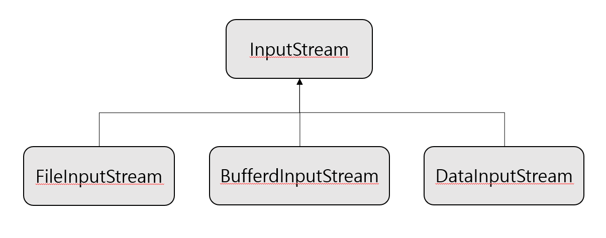

## 파일 입출력


#### IO 패키지 

자바에서 데이터는 스트림(Steam)을 통해 입출력되므로, 스트림의 특징을 알아야한다.


#### 스트림(Stream)

스트림은 단방향 통신만 가능하며, 순서가 있는 데이터를 운반하는데 사용되는 연결 통로이다.

입력 스트림과 출력 스트림으로 구분된다.

###### 입력 스트림

데이터 소스에서 데이터를 읽기 위한 스트림.

키보드, 파일, 네트워크상의 프로그램 등에서 출발.

###### 출력 스트림

데이터 소스에 데이터를 소비하기 위한 스트림.

모니터, 파일, 네트워크상의 프로그램으로 도착.


java.io.패키지에서 입출력 API 제공. 

| java.io 패키지의 주요 클래스                                 | 설명                                                  |
| ------------------------------------------------------------ | ----------------------------------------------------- |
| File                                                         | 파일 시스템의 파일 정보를 얻기 위한 클래스            |
| Console                                                      | 콘솔로부터 문자를 입출력하기 위한 클래스              |
| inputStream / OutputStream                                   | 바이트 단위 입출력을 위한 최상위 입출력 스트림 클래스 |
| FileInputStream / FileOutputStream<br />DataInputStream / DataOutputStream<br />ObjectInputStream / ObjectOutputStream<br />PrintStream<br />BufferInputStream / BufferedOutputStream | 바이트 단위 입출력을 위한 하위 스트림 클래스          |
| Reader / Writer                                              | 문자 단위 입출력을 위한 최상위 입출력 스트림 클래스   |
| FileReader / FileWriter<br />InputStreamReader / OutputStreamWriter<br />PrintWriter<br />BufferedReader / BufferedWriter | 문자 단위 입출력을 위한 하위 스트림 클래스            |


###### 스트림의 종류

| 바이트 스트림(byte stream)        | 데이터 종류가 파일, 그림, 동영상 등의 바이트 기반인 경우 8비트 단위로 입출력하는 클래스 |
| --------------------------------- | ------------------------------------------------------------ |
| **문자 스트림(character stream)** | **문자 데이터를 입출력하는 클래스**                          |


#### InputStream

바이트 기반 입력 스트림의 최상 클래스로, 추상클래스이다. 모튼 바이트 기반 입력 스트림은 이 클래스를 상속받아 만들어진다.



InputStream 클래스는 바이트 기반 입력 스트림이 기본적으로 가져야 할 메소드가 정의된다.

| 리턴 타입 | 메소드                           | 설명                                                         |
| --------- | -------------------------------- | ------------------------------------------------------------ |
| int       | read()                           | 입력 스트림으로부터 1바이트를 읽고 읽은 바이트를 리턴한다    |
| int       | read(byte[] b)                   | 입력 스트림으로부터 읽은 바이트들을 매개값으로 주어진 바이트 배열 b에 저장하고 실제로 읽은 바이트 수를 리턴한다. |
| int       | read(byte[] b, int off, int len) | 입력 스트림으로부터 len개의 바이트만큼 읽고 매개값으로 주어진 바이트 배열 b[off]부터 len개까지 저장한다. 그리고 실제로 읽은 바이트 수인 len개를 리턴한다. 만약 len 개를 모두 읽지 못하면 실제로 읽은 바이트 수를 리턴한다. |
| void      | close()                          | 사용한 시스템 자원을 반납하고 입력 스트림을 닫는다.          |


##### read() 메소드

입력 스트림에서 1바이트를 읽고 4바이트 int로 리턴한다. 따라서, 리턴된 4바이트중 끝의 1바이트에만 데이터가 들어가있으며, 입력 스트림에서 5개의 바이트가 들어오면 read()메소드로 1바이트씩 5번 읽는다.

더 이상 입력스트림으로부터 바이트를 읽을 수 없으면 read()메소드는 -1을 리턴하며, 이를 이용해 읽을 수 있는 마지막 바이트까지 루프를 돌며 한 바이트씩 읽을 수 있다.

```java
InputStream is = ne wFileInputStream("C:/test.jpg");
int readByte;
while ((readByte=is.read()) != -1) { ... }
```


##### read(Byte[] b 메소드)

입력 스트림으로부터 매개값으로 주어진 바이트 배열의 길이만큼 바이트를 읽고 배열에 저장하며, 읽은 바이트 수를 리턴한다. 읽은 바이트 수가 배열의 길이보다 작으면 읽은 수만큼 리턴하며, 거 이상 읽을 수 없으면 -1을 리턴한다.

read(byte[] b)메소드는 한 번 읽을 떄 매개값으로 주어진 바이트 배열 길이만큼 읽기에, 루핑 횟수가 줄어든다. 따라서 많은 양의 바이틀를 읽는데 적합하다.


##### read(byte[] b, int off, int len)메소드

입력 스트림으로부터 len 개의 바이트만큼 읽고, 매개값으로 주어진 바이트 배열 b[off]부터 len개까지 저장한다. 그리고 읽은 바이트 수인 len개를 리턴한다. 실제로 읽은 바이트 수가 len보다 작을 경우, 읽은 수만큼 리턴한다. 해당 메소드 역시 입력 스트림으로부터 바이트를 읽을 수 없으면 -1을 반환하며, read(byte[] b)와의 차이점은 한번에 읽어들이는 바이트 수를 len 매개값으로 조절할 수 이고, 배열에서 저장이 시작되는 인덱스를 지정할 수 있다는 것이다.


##### close() 메소드

InputStream을 더 이상 사용하지 않을 경우, close()메소드를 호출해 InputStream에서 사용한 시스템 자원을 풀어준다.

````java
is.close();
````


